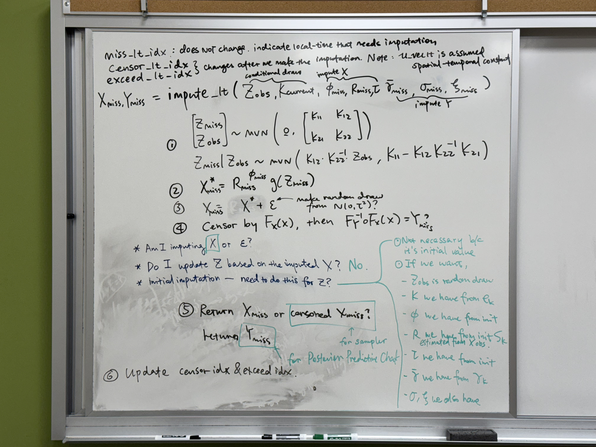

# Notebook on GPD Project

## TODOs

- (December and January; now it needs February too) emulation
  - Directly emulate the likelihood
    - Ben and Likun think this will work better
  - Can we use Emily's work on Variational Bayes Nerual Framework?
    - Likun & Ben: No, because the dimensionality of our parameter space is too large


- (On Hold until emulator) Start Coverage Analysis
  - estimated to take 10 months for a chain of 500 sites, cores oversubscribed by 10
  - without imputation
    - might want to try WITH imputation?
  - [Alpine allocation](https://colostate.sharepoint.com/sites/Division_Research_Computing_and_Cyberinfrastructure/Shared%20Documents/Forms/AllItems.aspx?id=%2Fsites%2FDivision%5FResearch%5FComputing%5Fand%5FCyberinfrastructure%2FShared%20Documents%2FGeneral%2FPUBLIC%2DWEB%2DCONTENT%2FAlpine%20Project%20Allocation%20Request%20Process%2Epdf&parent=%2Fsites%2FDivision%5FResearch%5FComputing%5Fand%5FCyberinfrastructure%2FShared%20Documents%2FGeneral%2FPUBLIC%2DWEB%2DCONTENT&p=true&ga=1)

# Meetings

## Mar. 11 (Tuesday) Muyang/Likun/Ben

## Mar. 4 (Tuesday) Muyang/Likun/Ben

### Logistics:
  - [ ] March 15 deadline for EVA contributed paper

### Sampler:
  - [x] Put `qRW()` emulator into the sampler
    - put inside the `utilities.py`
    - `utilities.py` will now load `qRW_NN_weights_and_biases.pkl`, `qRW_NN_X_min.npy`, and `qRW_NN_X_max.npy`
    - <mark>DON'T CHANGE PACKAGE's VERSION! LESSON LEARNED!!</mark>
  - [x] Initialize `X` and `dX`
    - [x] Only need to initialize the observed site-time.
    - The missing site-time will be imputed during initial imputation
      - [x] update X?
      - [x] update dX?
  - [x] Keep track of `X = qRW(...)` and `dX = dRW(...)` separately outside the likelihood function
    - ideally, fewer calls to the `qRW_NN_2p` predict function (make one big prediction instead of many small predictions)
    - `dRW` is essentially only necessary for the exceedance points
    - swap the `ll_1t(...)` to `ll_1t_qRWdRWout(...)` in 
      - [x] pre-update llik_1t_current
      - [x] $S_t$
      - [x] $\gamma_k$
        - Update X
        - Update dX
      - [x] $Z_t$
      - [x] $\phi$
        - Update X
        - Update dX
      - [x] $\rho$
      - [x] $\tau$
        - Update X
        - Update dX
      - [x] $\sigma_{GPD}$
        - Update X
        - Update dX
      - [x] $\xi_{GPD}$
        - Update X
        - Update dX
      - [x] imputation
        - Update X
        - Update dX
      - [x] post iteration detail likelihood
  - [x] Check sampler speed
    - 50 sites 60 time replicates. 1 second per iter.
  - [x] in the sampler, reduce the $Z_t$ into block updates
    - No need, because when updating $Z_t$`[obs_idx_1t]`, there is no `qRW` nor `dRW` calculation.
  - [x] `dRW(...)` only keep track for
    - the observed-exceedance and the missing (because they could be switching between exceedance and censored) `miss_idx_1t`
    - no need to calculated observed censored, because we will never use their `dRW` so we can keep their `dRW` as `np.nan`
    - i.e., we need the union of `miss_idx_1t` and `exceed_idx_1t`. 
      - `miss_union_exceed_idx_1t_current = np.union1d(exceed_idx_1t_current, miss_idx_1t)`
  - [x] Check sampler speed
    - ~3 hours to finish the full `dRW` version on (Ns, Nt) = 50x60 dataset
    - 1.4 sec per iter using full `dRW`
    - 1.33 sec per iter using reduced `dRW`
    - misspiggy is also being occupied.
  - [ ] we could even try updating $\gamma_k$ too?

### Convergence:
  - <mark>discuss</mark> No acceptance because ratio is inf
    - `r = np.exp(llik_proposal - llik_current)`, `if np.isfinite(r) and r >= random_generator.uniform():`
    - 
    - `if r == np.inf and np.isfinite(llik_proposal)`: accept?
  - <mark>discuss</mark> when updating $\sigma$ and $\xi$, we might need to add a check such that the current $Y$ is not impossible? Or limit the shape parameter to be larger than 0?
    - `dCGP(Y, p, u, sigma, xi) == 0`
    - may not be necesary, because there is a part of the likelihood being `+ np.log(dCGP)`, which will be `-np.inf` if Y not possible.
    - NECESSARY! SEE REASONING BELOW!
    - Chain (involving `qRW` terms) becomes stagnant after 400 iters?
  - Chain that update $\phi$ alone is fine
    - 
  - Chaint hat update $\phi$ and $\tau$ alone is fine
    - 
    - 
  - Chain that update $\phi$, $\tau$ and $\rho$ also fine.
    - 
    - 
    - 
  - Chain that update $\phi$, $\tau$, $\rho$, and $S_t$ also appears to be fine.
    - 
    - 
    - 
    - 
  - Chain that update $\phi$, $\tau$, $\rho$, $S_t$ and adding $\beta_{\sigma}$ obliterate the update
    - 
    - 
    - Comes back to the point of when updating $\sigma$ and $\xi$, we need to check such that $`dCGP(Y_1t_current, u_vec, sigma_proposal and/or xi proposal)` needs to be > 0. Otherwise, we might deal with the case that `dCGP(..) = 0` and `pCGP(..) = 1`, and `qRW` will try to predict that `p = 1` and then sometimes when that update get accepted, it will break the udpate.
    - After adding the check, it starts mixing:
      - 
      - 
      - 
  - With the fix, after adding $\beta_{\xi}$, the chain also mix.
    - mixing for the marginal parameters are bad (for the $\beta$), they don't change, but I think that's OK for now. For real dataset, it will change? (e.g <mark>modify the proposal covariance matrix $\Sigma_0$</mark>)
  - Have the $Z_t$ be running, but it should be okay.
    - 
    - 
    - 
    - 
    - 
```
if not np.isfinite(r) and llik_proposal > llik_current and np.isfinite(llik_proposal):
  num_accepted[key] += 1
  phi_accepted       = True
```

### Coverage Analysis
- simulate one bigger dataset
  - Tried $Ns = 625, Nt = 600$ and got error `ORTE_ERROR_LOG: The system limit on number of pipes a process can open was reached in file odls_default_module.c at line 642` on misspiggy
  - Still the same issue with $Nt = 300$
    - Try `ulimit -n 65535` to increase file descriptor limit temporarily, before running `mpirun -n <Nt> --oversubscribe ...`
    - And it worked!
  - `pgrep -lf sampler_qRWdRWoutside.py` lists the PIDs, since now htop will be slow.
    - `kill 1605855` will TERM the `mpirun`
  - A portion of 0.76 is interpolated. Still callling `qRW` quite many times
    - [ ] Figure out which dimension is extraplating
      - is it the $p$? because $\bar{\gamma}$ is well inside the range, and $\phi$ shouldn't be too bad, either.
  - 600 seconds per 1 iteration, 5 times the oversubscribe
    - could be faster because Chien-Chung using 128 cores
### Emulation:
  - dRW
    - [-] emulate `dRW` if necessary; seems not necessary
  - qRW
    - [ ] <mark>Question</mark> The emulator output must not be too large for the `tanh` to work right because it output between [-1, 1]
    - [ ] See if we can further train on [0.9, 0.99999], and interpolate within [0.9, 0.9999]
      - oversampling the large $p$ regsion:
        - [ ] simply/naively increase the emulation bound to 0.99999, change nothing else; see how the emulator perform.
        - [x] exponentially more design points toward 1 using
          - $p_{min} + (p_{max} - p_{min}) * \dfrac{1 - \exp(-\beta * u)}{1 - \exp(-\beta)}$
          - 

## Feb. 25 (Tuesday) Muyang/Likun/Ben

Logistics:
  - Weather and Climate Extremes Workshop, student registration code?

Likelihood Emulation:
  - Neural Network
    - [x] reduce one dimension, using $(Y-u)$
      - `X_lhs[:,0] = np.maximum(0, X_lhs[:,0] - X_lhs[:,1])`
        - `ll_1t_X_100000000_Y_minus_u.npy`
        - `ll_1t_X_val_1000000_Y_minus_u.npy`
      - [x] Further split the reduced dataset into censored part and exceedance part
        - `ll_1t_X_exceed_100000000_Y_minus_u.npy`
        - `ll_1t_X_val_exceed_1000000_Y_minus_u.npy`
        - `ll_1t_X_censored_100000000_Y_minus_u.npy`
        - `ll_1t_X_val_censored_1000000_Y_minus_u.npy`
      - penalize large likelihood values heavier?
      - [x] upload the dataset to OneDrive and email Likun
      - A histogram of `X` scaled into unit hypercube 
      - The high bar around 0 is just due to `X[:,0]`-- the $(Y-u)$ dimension. This was also seen in the previous training data looking at the scaled `Y` dimension. We scaled by `(X - X_min) / (X_max - X_min)`, and the range is big so histogram of this dimension looks like 
    - Separate emulator
      - emulate the exceedance
        - Still very bad with $(Y-u)$. Suspecting it's because too many small observations and relatively very few large observations due to heavi-tailness.
        - 
    - Regenerate design points.
      - How I estimated $u$, $\sigma$, and $\xi$: `format_data.R` site-wise GP fit to threshold 0.95. $u$ taken as the threshold. <mark>p = 0.95</mark>
      - [x] Regenerate exceedance design points. Instead of calculating $(Y-u)$ by inverting GP CDF, directly generate them using Latin Hypercube.
        - LB = 0.001 
        - UB = 1000
          - qGP(0.999, u=0, $\sigma$=60, $\xi$=1)=59940, 
          - `np.nanmax(data) = 737.9`
        - will see `nan` because in the exceedance likelihood piece, there is a `np.log(dCGP(Y, p, u=0, scale, shape))`, when tail is bounded and Y (Y-u) is too big, there is problem.
        - Roughly 50% are usable (not `-inf`); The `-inf` will just evaluate to 0 on original scale likelihood.
      - [x] Regenerate censored design points. 
        - $u \in (30, 80)$ based on dataset
    - [x] Separate emulator
      - [x] emulate the exeedance
        - There is no `nan`, only `-inf`. 56.9% of the log likelihood are not `-inf`; however, some of those log likelihood are super small, that only 5.86% non-log likelihood are non-zero
        - Train with the zeros
          - the training and validation error does not really decrease
        - Train without the zeros
          - still couldn't get it to work.
          - Also tried `log(10 + Y)`
          - Prediction line is pretty flat
          - 
          - 
      - [-] emulate the censored
        - not helpful unless the exceedance emulator can work
    - [-] Two head emulator

Distribution Function emulation:
  - [x] qRW 
    - [x] replicate Likun's
      - three 512-node layers, with `tanh` activation functions and linear output layers. 
      - [-] Question: The output must not be too large for `tanh` to work, right? because it's in [-1,1]?
      - log response
      - weighted mse: $w(q) = 1 + \alpha \cdot q$
      - 
      - 
      - 
      - 
      - Within [0.9, 0.999] is safe:
        - 
        - 
    - [ ] Modify Likun's
      - [ ] oversampling the large-$p$ region
  - dRW 
    - [x] generate design points
    - [-] emulate

Sampler:
  - [-] we could even try updating $\gamma_k$ too?
  - [-] Generate simulated dataset with threshold probability `p=0.95`
  - Plug in `qRW` emualtor
    - [-] in the sampler, reduce the number of times `qRW` and `dRW` are involved.
      - qRW should be calculated outside
        - ideally, fewer calls to the predict function (make one big prediction instead of many small predictions)
      - dRW should be calculated outside
        - only necessary for the exceedance points
    - [-] in the sampler, reduce the $Z_t$ into block updates
    - [-] Check sampler speed


## Feb. 18 (Tuesday) Muyang/Likun/Ben

Logistics:
  - STAT 740

- [x] Learn to allocation GPU memory
  - don't use standalone keras. Use `from tensorflow import keras` and never do `from keras import ...` or `import keras`

Likelihood NN emulator:
  - [x] Rescale training X to be in the unit hypercube
    - pickle save `history = model.fit`
    - save `X_min.npy` and `X_max.npy` for future prediction
    - [x] same model structure as before (512-512-512-512-512)
      - register spill over with `float64`
      - numerous optimization -- indeed speed up training drastically!
        - TensorFlow32
        - JIT compile with XLA
        - mixed_float16
      - still register spill out. Potentially need to reduce `batch_size` from 8192 to 4096; but training speed is tolorable, maybe no need.
      - The smalle model even with the re-scaling of X into the unit hypercube does not give good prediction.
      - Trained to 1,000 epochs, and the performance is still bad.
    - an even bigger model (512-1024-2048-2048-2048-1024-512-1)
      - this is too big and will outspill registers
  - Somehow incorporate CNN?
    - Troy did weighted sum of a row
    - Can we use a filter to let the NN know if a point is censored?
    - CNN is still not the ideal solution here.

Separate emulators for exceedance and censored pieces:
  - If we have an emulator of the exceedance and an emulator of the `qRW`, we can get away with not emulating the `dRW`
  - [x] emulator of the exceedance
    - `Y_L_1t1s_nn(Ws, bs, acts, X_val)` produce negative outputs in some places. Changing the output layer to `ReLU`.
    - 
    - A lot of zeros in the output. Changing the last layer to `softplus` and increasing the size of the model slightly helps. Also, utilizing `MAE` loss function
      -  (first 1000 points)
      -  (still bad overall)
    - [-] penalize large likelihood values heavier (like Likun did with the quantile function)
    - [x] A much larger model?
      - (512-1024-2048-2048-2048-1024-512-1)
      - check the number of parameters of the model: roughly 13 millions params
      - 
    - Only emulate the exceedance part of $(Y - u)$? This would reduce one dimension of the input
  - [x] emulator of the censored
    - Seen an weird bug in `OUTPUT20250220_trial.txt` that prediction is invoking numerical integration, but in truth we are not extrapolating.
    - The bug is because `X_val` was rescaled, previously, before training. Then when it feeds into the `ll_2p` function it will look like it is extrapolation.
    - (512-512-512-512-512-1)
      - 
    - For censored likelihood, the computation bottleneck is in `qRW(0.9, phi, gamma, tau)` the `p` here will be fixed, emulating this fixed-`p` `qRW` should be easy?

Two-head emulator for exceedance and censored pieces:
  - maybe this help because of the `qRW` part that is used in both censored and (much more extensively in) exceedance part?

Other methods to emulate the likelihood:
  - [x] Local polynomial interpolator, specify # of neighbors
    - remember to try this one more time with scaled input X
    - `multiquadric` kernel
      - 
    - `thin_plate_spline` kernel
      - 
    - prediction time is very long ~ 3 minutes (compare to neural networks couple of seconds)

Quantile function NN emulator:
  - [-] `qRW()` regenerate Likun's fit with modified weighted loss function
  - `dRW()` train a density funciton emulator
    - range of parameters
      - keep $\phi$, $\gamma$, $\tau$ the same with the `qRW` emulator
      - range on X
        - only `exceed_ll` involves `dRW`
        - `X = qRW(pCGP(Y, p, u_vec, scale_vec, shape_vec, phi_vec, gamma_bar_vec, tau)` so `X` has be to larger than `qRW(0.9, ...)`
        - `qRW(0.9, 0.05, 0.5, 1)    = 10.457873773698486`
        - `qRW(0.9999, 0.95, 5, 100) = 402114519.4524983`
      - Should train on `log(dRW)`? because density are very small/close to 0.
        - wait until the design points are generated, look at the range of the response, then decide whether to train on original scale or logged scale
    - [-] calculate design points
    - [-] train emulator
      - train with X in the unit hypercube

Sampler Chain:
  - underestimation of $\phi$ really does seem to be fixed
  - overestimation of $\tau$ is still present, but nothing too crazy.

## Feb. 11 (Tuesday) Muyang/Likun/Ben

Logistics:
  - Kevin Worthington
    - [x] Yes, I will contact Kevin Worthington
    - [x] Send Boes Teaching Award application materials to Ben
  - May 5. 1 - 3 PM works for Ben?
    - [x] Email Alex
  - EnviBayes should I go?
    - [x] Yes, reply to the email

On emulating the likelihood:
  - [x] Bigger Model
  - [x] Smaller Learning Rate
    - Model is big: (128-256-512-512-512-256-128)
    - training takes a long time (~22 min per epoch)
    - after ~100 epochs validation error seems to plateau at around 0.08 (Note that the training loss is also not in monotonic decrease, maybe because of the batch_size?)
      - Further training with decreased learning rate?
        - Re-compile the model, load model weights, and then start with a smaller weights?
        - Can we continue training with a different learning rate?
    - Model is not good, try Likun's configuration:
      - (512-512-512-512-512)
      - 100 epochs is not enough
  - [x] Goodness of Fit plot
    - Bad. see `./data/20240214_NN_Y_ll_1t`

On emulating the quantile function:
  - weighted loss function
    - e.g.
```
def weighted_mse_loss(pred, target, alpha=1.0, eps=1e-8):
    weights = 1.0 + alpha * target
    
    # Weighted sum of squared errors
    mse = weights * (pred - target)**2
    
    # Normalize by the sum of weights
    wmse = mse.sum() / (weights.sum() + eps)
    return wms
```
  - Goodness of Fit plot?

Compare to other methods
  - scipy.interpolate (spline emulator)
  - Jaywoos KDTrees local polynomial

- [x] Rerun the sampler after fixing the bug in `utilities.py` about the likelihood
  - see if $\phi$ is still under-estimated
  - `np.NINF` removed in Numpy 2.0. Change to `-np.inf`

## Feb. 4 (Tuesday) Muyang/Likun/Ben

Emulating the likleihood:

- [x] One big prediction instead of several samll prediction

- [x] Investiage `nan` outputs
    - there are `nan` output in neural network outputs. What are they? They are: 
    - low bound of `pR=0.01` isn't sufficiently small for `scale = 8.0`.
      - There are many data points in the simulated dataset that has `R` smaller than `scipy.stats.levy(loc=0,scale=8.0).ppf(0.01) = 1.2`
      - There are also many data points in the simulated dataset that has `R` larger than `scipy.stats.levy(loc=0,scale=8.0).ppf(0.95) = 2034`
      - Some of these points lead to a prediction, some leads to `nan`
      - Many of the `nan`'s corresponding input X don't fall inside the training range; but some of the `nan`'s corresponds to interpolation range. The `nan` comes from the model outputting negative values, which becomes `nan` once we take `np.log()` to get log likelihood
        - Changed the prediction function to output zero if the predicted value is negative, i.e. don't do `log(neg)`
      - [x] what are the precise bound for `Y` and `R`?
        - `R`
          - `scipy.stats.levy(loc=0,scale=8.0).ppf(0.01) = 1.2`
          - `scipy.stats.levy(loc=0,scale=8.0).ppf(0.95) = 2034`
        - `Y`
          - `np.min(X_lhs[:,0]) = 30.0`
          - `np.max(X_lhs[:,0]) = 6019.999999999992`
      - [x] What proportion of each parameter falls within the range of design points?
- [x] Need to add a check for extrapolation
  - [x] what proportion of the overall predictions fall outside the training range
  - 
  - 36% of the simulated dataset falls outside the training range
  - This time, after incorporating the 2-piece for extrapolation, there is no more `nan` or even 0!
    - `np.where(ll_phi_NN_opt_2p == 0) --> (array([], dtype=int64), array([], dtype=int64))`
    - `np.where(np.isnan(ll_phi_NN_opt_2p)) --> (array([], dtype=int64), array([], dtype=int64))`
  - 
  - 
  - 
- [x] Re-train Neural Network with a wider range on R
  - [x] Figure out range of R?
    - `np.min(input_list[:,4]) = 0.057`
    - `np.max(input_list[:,4]) = 112775`
    - So let's use 0.01 to 5000000, because
      - `scipy.stats.levy(loc=0,scale=0.5).ppf(0.001) = 0.046`
      - `scipy.stats.levy(loc=0, scale=8.0).ppf(0.999) = 5092955`
  - [x] Calculate the design points and validation points
  - [x] Train the NN and try out several structures
    - 
    - 
  - If result is bad, 
    - [-] Ben: Train the likelihood with the input X in the hypercube
    - [-] Try a bigger model?
    - [-] Spline emulator on the original scale likelihood?


- Contact Reetam
  - goodness-of-fit plot (If fit is good, but prediction is bad)
    - [x] Goodness-of-fit plot on the validation dataset (might need to do this on `misspiggy` due to memory issue)
      - 
      - 
    - [x] Goodness-of-fit plot on the simulated dataset
  - variable importance plots (If `fit` itself is bad)
    - [ ] what's variable importance plot? How to draw one


- [ ] CMU Group Papper
  - No need to evaluate likelihood, as long as we can simulate from the model?


Logistics
  - [x] Summer 2025 Funding? Teaching Assignments?
  - [x] Department Scholarships and Awards, need nomination
  - [x] Conferences Registration
    - JSM
    - WACE
    - EVA

## Jan. 28 (Tuesday) Muyang/Likun/Ben

- Read the papers
  - [ ] Bayesian Inference in the Presence of Intractable Normalizing Functions
  - [ ] A Function Emulation Approach for Doubly Intractable Distributions
  - [ ] Accelerating Asymptotically Exact MCMC for Computationally Intensive Models via Local Approximations
  - [ ] Neural Likelihood Surfaces for Spatial Processes with Computationally Intensive or Intractable Likelihoods

- [x] Document the code sent to Likun

- training on the **likelihood directly**
  - [x] Generate new design points
  - [x] different activation function
    - `ELU`
  - [x] original likelihood
  - Train the first 50 epoch:
    - 
    - 
    - 
  - Keep training, each time for an additional 50 epochs
    - If the emulator cannot learn the "curvature", try making the model bigger?
    - 
    - 
    - 
  - [-] Need to add a check for extrapolation
    - there are `nan` output in neural network outputs. What are they?
  - [-] Make one big prediction instead of several small prediction


- More exploration on emulating the **quantile function**
  - [x] Keras model initialize weights using last training records, as large batch_size = 1024 didn't coverge in 50 epochs
    - just do `keras.models.load_model()`, set `epochs` and `initial_epoch` accordingly (e.g. `epochs=100` with `initial_epoch = 50` will yield 51/100, 52/100, ...)
    - does not coverge in 100 epochs
      - 
      - 
    - does not coverge in 200 epochs
      - 
      - 
    - training to 300 epochs
      - 
      - 
      - 
      - 
      - 
      - Results on the marginal likelihood
        - 
        - 
        - We are seeing improvement. Maybe: additional training on bigger batch_size is required.
  - [x] add additional printing
  - [x] Make one big prediction instead of several parallelized small prediction
    - Making one big prediction is fast, but I suspect `dX` still uses lots of time.
```
Doing N_t calls to qRW_NN
elapsed: 0.0 0.2
elapsed: 19.726 0.35000000000000003
elapsed: 37.988 0.40640640021762764
elapsed: 53.601 0.5
elapsed: 80.961 0.6500000000000001
elapsed: 105.948 0.8

Doing one call to qRW_NN( big X of size (Nt, Ns))
elapsed: 0.0 0.2
elapsed: 16.183 0.35000000000000003
elapsed: 33.922 0.40640640021762764
elapsed: 52.683 0.5
elapsed: 73.785 0.6500000000000001
elapsed: 89.36 0.8

ll_phi_NN_2p_opt = []
start_time = time.time()
for phi_x in phi_grid:
    print('elapsed:', round(time.time() - start_time, 3), phi_x)

    phi_k        = phi_at_knots.copy()
    phi_k[i]     = phi_x
    phi_vec_test = gaussian_weight_matrix_phi @ phi_k

    # Calculate the X all at once
    input_list = [] # used to calculate X
    for t in range(Nt):
        pY_t = pCGP(Y[:,t], p, u_matrix[:,t], Scale_matrix[:,t], Shape_matrix[:,t])
        X_t = np.column_stack((pY_t, phi_vec_test, gamma_bar_vec, np.full((len(pY_t),), tau)))
        input_list.append(X_t)

    X_nn = qRW_NN_2p(np.vstack(input_list), Ws, bs, acts)

    # Split the X to each t, and use the 
    # calculated X to calculate likelihood
    X_nn = X_nn.reshape(Nt, Ns).T

    args_list = []

    for t in range(Nt):
        # marginal process
        Y_1t      = Y[:,t]
        u_vec     = u_matrix[:,t]
        Scale_vec = Scale_matrix[:,t]
        Shape_vec = Shape_matrix[:,t]

        # copula process
        R_vec     = wendland_weight_matrix_S @ S_at_knots[:,t]
        Z_1t      = Z[:,t]
        logS_vec  = np.log(S_at_knots[:,t])

        censored_idx_1t = np.where(Y_1t <= u_vec)[0]
        exceed_idx_1t   = np.where(Y_1t  > u_vec)[0]

        X_1t      = X_nn[:,t]

        args_list.append((Y_1t, p, u_vec, Scale_vec, Shape_vec,
                        R_vec, Z_1t, K, phi_vec_test, gamma_bar_vec, tau,
                        logS_vec, gamma_k_vec, censored_idx_1t, exceed_idx_1t,
                        X_1t, Ws, bs, acts))
    
    with multiprocessing.get_context('fork').Pool(processes = n_processes) as pool:
        results = pool.map(ll_1t_par_NN_2p_opt, args_list)
    ll_phi_NN_2p_opt.append(np.array(results))

ll_phi_NN_2p_opt = np.array(ll_phi_NN_2p_opt)
np.save(rf'll_phi_NN_2p_opt_k{i}', ll_phi_NN_2p_opt)
```
  - [ ] exponential activation function
  - [ ] oversampling the large p region
  - [ ] different weighting error function

- GPU
  - can't train two neural network's simultaneously. They fight for memory.

## Jan. 23 (Thursday) Muyang/Likun/Ben

- [ ] why is there no speed gain?
  - what proportion of predictions happens within the emulated range?
  - Each call to `NN_predict` is costly, but `NN_predict` can do a lot of things very fast at once -- utilize this
  - `dX` is taking lots of time?

- Fix a bug:
  - [x] `dX     = dRW(X, u_vec, scale_vec, shape_vec)`

- Ben: tryout different neural network structures and activation functions
  - train the likelihood 
    - [-] with a different activation function (that takes negative values)
    - [-] Train the original likelihood, not the log likelihood
  - train the `qRW` quantile
    - [x] try one version with a large number of layers and nodes, potentially with different activation functions
      - four 64-node layers with `ELU` activation, `mean_squared_logarithmic_error`, and larger `batch_size` of 256
      - 
    - (32-64-128-64-32) with `ReLU` using `mean_squared_logarithmic_error` and larger `batch_size` of 512
      - 
      - The extra layer and the increased batch_size seem to help
        - 
        - [x] why is the result so bad?
          - because `qRW` isn't interpolating well on non-design point region
          - 
      - [x] further increasing them
        - (32-64-128-256-64-32) with `batch_size` 1024
    - Other potential solution involves
      - [-] oversampling the large p region
      - [-] weight the errors heavier at large p
      - [-] try the exponential activation function?

- Likun: Convolutional Neural Network to utilize the smoothness within a parameter's space?

- It is using GPU
  - `tf.config.experimental.list_physical_devices('GPU')`
  - checked GPU usage by `nvidia-smi`
    - 
    - 
  - larger batch_size utilize the parallelization from GPU, so trains faster

- Underestimation of $\phi$:
  - [ ] is it just this dataset? Try a different seed.
  - [ ] do a chain that updates $\phi$ + ...
## Winter break

This code takes only 0.3 seconds, as oppose to 18 seconds when doing `Nt` times of `NN_predict`.
```
ll = []
X_inputs = []

for t in range(Nt):
    Y_1t      = Y[:,t]
    u_vec     = u_matrix[:,t]
    Scale_vec = Scale_matrix[:,t]
    Shape_vec = Shape_matrix[:,t]
    R_vec     = wendland_weight_matrix_S @ S_at_knots[:,t]
    Z_1t      = Z[:,t]
    logS_vec  = np.log(S_at_knots[:,t])
    censored_idx_1t = np.where(Y_1t <= u_vec)[0]
    exceed_idx_1t   = np.where(Y_1t  > u_vec)[0]

    X_input = np.array([Y_1t, u_vec, Scale_vec, Shape_vec, R_vec, Z_1t, phi_vec_test, gamma_bar_vec, np.full_like(Y_1t, tau)]).T
    X_inputs.append(X_input)

    # Y_ll = NN_predict(Ws, bs, acts, X_input)
    S_ll = scipy.stats.levy.logpdf(np.exp(logS_vec),  scale = gamma_k_vec) + logS_vec # 0.5 here is the gamma_k, not \bar{\gamma}
    Z_ll = scipy.stats.multivariate_normal.logpdf(Z_1t, mean = None, cov = K)

    ll.append(np.sum(S_ll) + np.sum(Z_ll))
Y_ll_all = NN_predict(Ws,bs,acts,X_inputs)
Y_ll_split = np.split(Y_ll_all, Nt)
for t in range(Nt):
    ll[t] += np.sum(Y_ll_split[t])
```

- Emulation:
  - the CDF $F_X(x)$ or the quantile $F_X^{-1}(x)$:
    - Pre-train. Grid out the $\phi$ (at 0.001 intervals) and pre-specify some levels of $\tau$ (e.g. 1, 5, 10?) and store the calculated $F_X(x)$?
      - $\tau$ is heavily over-estimated, so we might want to <mark>just fix it</mark>? (In which case, pre-computation is managable for `pRW/qRW`?)
      - $\gamma$ will also need a wide range, specifying any possible $\bar{\gamma}_j$ in the spatial domain, for spatial prediction. Hence, there will be a lot of design points
    - Use neural network to train just (0.9, 0.9999), and use numerical integration for [0.9999,1)
      - [ ] TODO: Speed up the sampler (take `qRW` outside, block update for the $Z_t$)
      - [x] TODO: implement the 2-piece `qRW` (split by `p, phi, gamma, tau` bounds)
        - The NN's prediction is better to be called once; 
        - the numerical integration is better to be distributively calculated on each worker.
        - it should be fine ==> if we are not calling `NN_predict` $N_t$ times in a for-loop: we are using `mpi` so each worker core will take care of "one" $t$ from $N_t$
      - [x] TODO: taking a look at the marginal likelihood surface using the emulated `qRW_NN_2p` two-piece quantile function
        - 
      - 1/24 (Thursday)
        - direct training on `qRW` still leads to huge MSE. Should try LMSE next.
      - 1/22 (Wednesday)
        - train directly on not logged `qRW`
        - calculate a separate set of validation points
      - 1/21 (Tuesday)
        - `qRW`'s emulation isn't good enough:
          -  
          - MSE loss is quite small on the `log(qRW)`; this could be preventing "further training"?
          - [x] Can we try training directly on the not logged `qRW`?
            - or, use LMSE as error? (in case of overflow?)
      - 1/9 (Thursday)
        - [x] run the design points on `misspiggy`
      - 1/8 (Wednesday)
        - [x] Start coding `emulate_qRW.py`, an nn emulator on (0.9, 0.9999).
  - the likelihood
    - spline emulator
      - [ ] Do cross-validation (?) to select `degree` and `smoothing`
      - seemingly large training LMSE
    - neural network emulator, train with GPU
    - Notes:
      - 1/7 (Tuesday)
        - The `1,000,000` design point neural net on likelihood trained after about 300 epochs.
        - 
        - [x] Check nn LMSE: its prediction LMSE is 421 on the `10,000` design points
          - roughly LMSE of 8 on the training points
        - [x] Check nn marginal likelihood
          -  still very bad. Will look into `qRW` emulation next, with a hybrid approach
          - [x] why is it so slow when using multiprocessing? Using multiple processes do not speed it up over using single process
            - It's not multiprocessing's problem
            - It's better to **run `NN_predict` once** on a big input array, than to run `NN_predict` multiple times on several separate arrays:
          - [x] how to remove the `-Inf`?
      - 1/6 (Monday)
        - [x] Use the `1,000,000` design points to train NN emulator on likelihood. Then try marginal likelihood.
        - 
        - Need to write a function to use the `NN emulator` to predict
      - 1/4 (Saturday)
        - start calculating `1,000,000` design points on misspiggy
      - 1/3 (Friday)
        - maybe spline emulator on log (of log likelihood) is better?
          - training LMSE is 42 (on `10,000` design points)
        - create neural network emulator (there are "0"s in the training likelihoods, and we are training on log scales of the log-likelihoods. Hard code those as 0. When making prediction, do not `np.exp(0) = 1`, just return 0)
          - using log MSE, is training on log scales necessary?
      - 12/31 (Tuesday) plot emulated "marginal/profile" likelihood. spline emulator does not do well.
        - 
        - 
      - 12/30 (Monday) a likelihood function that takes an emulator for censoring likelihood on Y
      - 12/27 (Friday) an `RBFInterpolator`
      - 12/24-12/26, generate design points. 
        - On generating `Y`, if `Y` is too large and shape is negative (bounded tail), will run into `nan` `np.log(dCGP)`. How to generate the `Y`? We can generate `pY`, and if `pY` is $< 0.9$ just give it the corresponding threshold.
        - Modifying `Y` as above fix the issue with `dCGP`, but `dX` can still struggle sometimes, giving negative values. Try dropping these values/design points.
        - Looking at the histogram of the likelihoods, spline might be a better option because there are some very negative `Y` likelihoods
      - 12/23 installed `tensorflow` with GPU in a new environment conda env `(gpd)`
      
      
- Underestimation of $\phi$:
  - Chain that only update $\phi$ and $S$ is good:
    - 
  - (1/21) Chain that fixes $\rho$ and $\gamma_k$ doesn't resolve under-estimation on $\phi$
    - 
    - stagnant chains could be due to the `recv_bloc` error?
  - fix $\gamma$ and $\tau$ still leads to underestimation on some:
  - 
  - 1/3 run a chain that fix just $\rho$?

## Dec. 3 & 9 Tuesday Meeting with Likun/Ben

- Bypass numerical integration
  - Ben: maybe using Characteristic Functions and Fourier (and inverse Fourier) transform can by-pass the numerical integration
    - inversion theorem that goes directly from characteristic functions to CDF
    - an attempt at `FFT` is implemented.
      - not fast enough

- Emulator
  - `tensorflow-gpu`


- Underestimation of $\phi$
  - in the chain that **only** update $\phi$, 
    - $\phi$ is correctly updated.
  - currently running a chain that update both $\phi$ and $S$ on `fozzy`.
    - seems not too bad

## Nov. 21 Thursday Meeting with Ben

- Speed up
  - Estimated runtime: increasing the number of loops roughly increases the run time by a factor of 5. <mark>Without</mark> oversubscribing, on 500 sites, chain would take ~ 1 year to reach 10,000 iterations.
  - will **standard** Pareto with **Laplace** nugget yield no numerical integration?
    $$
    \begin{align*}
    1-F_{X_j}(x) &= \int_x^\infty q(\epsilon) \cdot P(X_j^* > x-\epsilon) d\epsilon + \int_{-\infty}^xq(\epsilon) \cdot P(X_j^* > x-\epsilon)d\epsilon \\
    &= \int_x^\infty q(\epsilon) d\epsilon + \int_{-\infty}^xq(\epsilon) \cdot \left(\sqrt{\dfrac{1}{\pi}} \gamma(0.5, \dfrac{\bar{\gamma_j}}{2(x-\epsilon)^{1/\phi_j}}) + \dfrac{1}{x-\epsilon}\sqrt{\dfrac{1}{\pi}}\left(\dfrac{\bar{\gamma_j}}{2}\right)^{\phi_j} \Gamma(\dfrac{1}{2} - \phi_j, \dfrac{\bar{\gamma_j}}{2(x-\epsilon)^{1/\phi_j}}) \right) d\epsilon
    \end{align*}
    $$
  - make the chains marginally faster by separating $X$, $d(X)$, and $X^*$?
  - neural network for likelihood directly
    - already a GPU on misspiggy; train NN with GPU

- under-estimation of $\phi$:
  - trade off between $\tau$ and $X^*$?
    - on `misspiggy` a chain without $\tau$ is running, `20241128`
  - fix everything but $\phi$, can it do good?
    - on `fozzy` a chain with ONLY $\phi$ is running, `20241202`
  - Will **shifted** Pareto with **Laplace** nugget resolve the underestimation?

- chain_wihtout_$\gamma_k$ stops updating after ~5300 iterations. Issue with the MPI bug?
  - added `os.environ["KMP_AFFINITY"] = "disabled" # export KMP_AFFINITY=disabled`, trying again on `misspiggy`


## Nov. 12 Tuesday Meeting with Ben/Likun/Mark

Notes:
- [x] Finish coding up (separate) draw observe and miss for $Z_t$
- [x] Fix $\gamma_k$ at truth and re-run the chain, see if $\phi_k$ still under estimates
  - 20241118 started chain in `./run`
- [x] Profile (marginal) likelihood for each $\phi_k$ to see if the likelihood is uni-modal
  - Yes it is uni-modal
  - Bad inference on $\phi_k$ comes from bad inference on $\rho_k$, then? Not sure.
- Likun: shifted Pareto with Laplace nugget term is also 1D integral

To Talk: 

- Verify sampler implementation on imputation

- Show underestimation of $\phi_k$

### Nov. 5 Tuesday Meeting with Ben

- Verify sampler implementation on imputation
  - When updating $Z_t$, just update $Z_{obs}$ with random walk
    - should it be random walk or a conditional draw?? Or maybe it doesn't matter?
  - When doing the imputation, draw $Z_{miss} | Z_{obs}$

- fix $\gamma_k$ at 1 for the simulation. Does $\phi$ still under-estimate?

- Quesiton: we can't make spatial prediction below the threshold?
  - Likun: Yes, the prediction will just be the threshold.

## Oct. 29 Tuesday Meeting with Likun/Mark/Ben

- Training grid for the emulator
  - This is also computationally intensive, needs to be put on hold.


- Keep runing the sampler 
  - `recv(20) failed: Connection reset by peer (104)`
    - $S_t$, $Z_t$, $\gamma_k$, $\phi_k$ seems to be updating, so stopped it
  - [x] Try updating: $S_t$, $Z_t$, $\gamma_k$, $\phi_k$, $\rho_k$, $\tau$
    - 20241030
    - Chain does seem to be mixing. $\tau$ is drastically overestimated. $\phi$ seems(?) to be underestimated at some knots, undercoverage?. $\rho_k$ seems to have large variance, overcoverage? $\gamma_k$ seems hard. Some very large variance, some shrink to 0.
    - No more connection recet by peers.
  - [x] Try updating: $S_t$, $Z_t$, $\gamma_k$, $\phi_k$, $\rho_k$, $\tau$, $\theta_{GP}$ (all parameters)
    - started 20241101 on fozzy
    - Also seems to be mixing. $\tau$ is also overestimated. Others are early to tell. $\gamma_k$ seems hard. Some very large variance, some shrink to 0.
  - [ ] Try updating: all parameters + imputation

- imputation
  - 
  - We might actually also need to <mark>impute $Z_t$</mark> !?
    - <mark>check:</mark> the imputation should change both $Z_t$ and $Y_t$? because we need the smooth process $X_t^*$
      - then, when updating $Z_t$ in its own section, do we update both the missing and observed, or only the observed? (Previously in GEV we didn't have this problem because we do not update $Z_t$.) -- will this break MCMC?
      - current code is that we are updating all $s$ in $Z_t(s)$ when updating $Z_t$
  - Return imputed $(Z_t, Y_t)$ is enough
    - As long as we have $Y_t$ and we updated the $Z_t$, everything else can be calculated
  - <mark>check:</mark> because there is censoring, how should we perform predictive check on $Y_t(s)$ (predictive check won't show anything for the censored site)? 
    - Do we just do it on exceedance sites (from simulation)?
    - Do we do it on $X_t(s)$?

- Coverage analysis
  - a python script that creates the folder structures, copy files, and write bash files
  - install/update Alpine `conda` environment
    - conda-forge
      - python=3.11
      - numpy=1.26
      - scipy=1.11
      - gstools=1.5
      - rpy2=3.5
      - matplotlib
      - geopandas
    - pip
      - `pip3 install tensorflow`
      - `pip3 install mpi4py==3.1.5`
        - to use other versions remember to remove the cache -- see website
    - R
      - `mgcv` for the thin-plate splines of $\mu_0$ and $\mu_1$ -- no longer needed here
        - `Matrix` unavailable for R <= 4.4, if install directly within R
        - install using `r-mgcv` from conda
    - Figure out folder structures (write scripts to generate data and run jobs)
      - change the `savefolder` and `loadfolder` in the `simulate_data.py` and the `sampler.py` script respectively
## Oct. 22 Meeting with Likun/Mark/Ben

- [x] Make the data $Y$ be from 10-day intervals.
  - Check the June 21 to Sept 21 definition of summer time
  - remove the 2 days or add additional 8 days
  - Using June 22 to Sept 19 to match 90 days
  - From the dataset, the scale and shape are estimated using spatially varying (temporal constant) thresholds.
    - Later in the sampler, the sampler creates a all-constant threshold

- Simulation study with threshold exeedance without marginals
  - Simulated dataset generates censored data. (reporting the threshold when observation is below the threshold). The censoring is performed using the distribution functions `pRW` on X.
  - For the realdata, however, 
    - censoring is performed in the sampler.py empirically.
    - Or it can happen in the data preprocessing (estimate $\sigma$ and $\xi$) to get spatially varying thresholds
  - Do MCMC for separately for each parameter (see who works)
    - [x] Update $S_t$
      - seems to work for $S_t$ when running only $S_t$ with $\gamma_k = 0.5$; using dataset `simulated_seed:2345_t:50_s:100_phi:nonstatsc2_rho:nonstat` radius = 4
      - [x] Try 50 sites, radius 3, will make it marginally faster for testing in progress -- seems to work
    - [x] Try update $\gamma_k$
    - [x] Try update both $S_t$ and $\gamma_k$
      - seems to be working 10/27
    - [x] Try update $S_t$, $Z_t$, $\gamma_k$
      - seems to be working 10/28
    - [x] Try update $S_t$, $Z_t$, $\gamma_k$, $\phi_k$
    - [-] Try update $S_t$, $Z_t$, $\gamma_k$, $\phi_k$, $\rho_k$
      - This one is probably harder to do with the just 50 sites? some knot does not contain many sites
      - potentially, increase the numebr of sites (if time permits)

- [x] "Unfix" $\gamma_k$
  - By changing the `gamma_at_knots`, `gamma_vec` ($\bar{\gamma}$) is calculated using Wendland basis matrix, and is used each time we call `qRW`
  - [x] Add the storage, update, and adaptive tuning for `gamma_at_knots`
    - [x] storage
    - [x] initialize
    - [x] update
      - [x] change corresponding `gamma_vec` to `gamma_vec_current`
      - [x] Need also modify the `ll_1t` function to add the `gamma_at_knot` in there, because `ll_1t` contains $p(S_t \mid \gamma_k)$ where $\gamma_k$ is no longer fixed
      - [x] Metropolis update -- <mark> discuss prior choice </mark>
      - saving
    - adaptive tuning
      - initialize
        - $\sigma_m^2$: `sigma_m_sq['gamma'] = list(np.diag(gamma_cov))` and `if rank == 0: with open('sigma_m_sq.pkl','rb') as file: sigma_m_sq = pickle.load(file)`
        - counter: `num_accepted['gamma'] = [0] * k_S`
      - tuning after $b$ iters
        - $\sigma_m^2$
        - counter

    - [x] plotting

  - [x] Change the `simulate_data.py` such that $\gamma_k$ is able to be spatially varying.
    - [x] Modify how $S_t$ is generated as now $\gamma$ is changed
    - [x] Modify the corresponding "hard coding truth for simulation" section in the `sampler.py`

- [x] Marginal model in the sampler

- [x] facilitate with posterior covariance matrix

## Oct. 15 Meeting with Likun/Ben

- Summarize (shrink) the data
  - truncate to JJA summertime data
  - for each season, split into subchunks, and take the max of each subchunk
  - fit GP to these

### Work

- [x] Separated knot_$S$, knot_$\phi$ and knot_$\rho$
- [x] Do not simplify likelihood calculation
  - e.g. $X_t$, `dRW`($X_t$);
  - easier for later emulator integration
  - exceedance/censored index can be simplified -- we can build an emulator just for the likelihood of the exceedances.

- [x] Summarize the likelihood into equations and document them here.
- [x] Incorporate $S_t$ likelihood into `ll_1t` function
  - [x] Change code updating $S_t$

- [x] Elevation from simulation data generation should not be negative
  - doesn't REALLY matter, but better if changed

### Question

- [x] Do we want to not fix $\gamma_k$ this time?
  - let's fix that at 1.
- [x] How to get site level MLE estimates for $\sigma$ and $\xi$ for GP?
  1. Ben: Have the threshold all constant for now.
  2. (Later) Likun: Make the threshold spatially varying, temporally constant
  3. (Later) Ben: Then smooth them, with splines?
      - Ben: We can't have a site at time t go above the threshold in some iterations and then below the threshold in some other iterations. It will break the MCMC.
- [x] How to estimate the initial nugget -- maybe from empirical semivariogram?
  - Ben: Certainly an option
- [x] Go over hierarchical model and full conditionals
  - [x] In the likelihood, <mark>do we need a piece for $R_t$, i.e. $p(R_t \mid \bar{\gamma})$</mark>? Or just put the $p(\bm{S}_t \mid \bm{\gamma})$? Are they the same?
    - Likun: the transformation is one-to-one, but we do not know $p(\bm{R_t} \mid \bar{\gamma})$ because some of them are correlated (not independent so can't be naively multiplied together).
  - [x] We directly update $S_t$ on log scale, so there's a jacobian; we also update $\sigma$ on a log scale, but we are actually update $\beta$, do we need a jacobian for the $\sigma$?
    - No because once $\beta$'s are know $\sigma$ is fixed; this is different from directly updating $\log \bm{S}_t$
    - Ben: STAN's online book as a section talking about this.
- In the MCMC updating $Z_t$, proposing $Z_t$ will surely change $X^*$ as $X^* = R^\phi g(Z)$. HOWEVER, <mark>do we need to change $X$ too based on $Z$ (or $R$) during update?</mark> i.e. do we need to keep track of our current $\epsilon$?
  - [x] After the update? (e.g. after accept proposed $Z$, we certainly change $X^*$, do we also change $X$?)
    - No
  - I think no because $X$ is marginal transformation from $Y$, which only depends are the marginal paraemter, $\phi$, ($\gamma$), and $\tau$.
- [x] Check that for updating $S_t$ and $Z_t$, because of assumed temporal independence, no need to gather likelihood and compare the sum; comparison of the individual ($ll_t$) is enough
- [x] Are we still conditioning on Time $t$? There is a lot more time replicates.

### Others

- 3 minute talk in Golden -- separate slides?
- spring 2025 TA and summer 2025 RA?
  - one semester in the 2025 - 2026 year RA
- [JCSDS](https://www.jconf-sds.com) 2025 7/11 - 13
- Supervise undergraduate students
- JSM 2025 topic-contributed session
  - Likun is doing Dynamic Space-Time modeling

## Oct.8 Meeting with Likun/Mark/Ben

- Daily data from Mark
  - Need to <mark>break the temporal independence</mark>
  - Maybe aggresively filter the data by time blocks, make $N_t$ to be roughly matching to 75.
    - Check in next meeting on how/what to do
- "task order":
  - Work on getting the sampler to work, first
  - Get a emulator, either for the `qRW` quantile function or for the `ll` likelihood function

- [x] Organize and Solidify the distribution functions
- Work on the sampler
  -  MPI oversubscribe

---

# Notes

## Thoughts

### Emulating the quantile funtion `qRW`

- consider trying out the RBFinterpolator from Scipy on the `qRW` function within a range, e.g. (0.95, 0.99999)
- consider the NN neural network on `qRW` function within range (0.95, 0.99999)


### Emulating the log-likelihood

- `emulate_ll_1t.py` fill the training X with LHS, then ppf to get the marginal Y from scale and shape
- `emulate_ll_1t_2.py` fill the training X with LHS, including the marginal Y that is also LHS'ly filled
  - had issue where $Y$ is out of support, leading to problem in $\log(\text{density})$, so created some filters

## Hierarchical Model and Likelihood

### Hierarcichal dependence model (and priors):

With index

$$
\begin{align*}
k &\in \{1, 2, \dots, K\} \quad \text{denoting number of knots (total $K$ knots)} \\
t &\in \{1, 2, \dots, T\} \quad \text{denoting time index (total $T$ time replicates)} \\
j &\in \{1, 2, \dots, D\} \quad \text{denoting site index (total $D$ locations)}
\end{align*}
$$

Hierarchical model written as:

$$
\begin{align*}
F_{Y \mid \bm{\theta}_{GP}, t}(Y_t(\bm{s}_j)) &= F_{X \mid \phi(\bm{s}_j), \bar{\gamma}(\bm{s}_j), \tau, t}(X_t(\bm{s}_j)) \\
&= F_{X \mid \phi(\bm{s}_j), \bar{\gamma}(\bm{s}_j), \tau, t}(R_t(\bm{s}_j)^{\phi(\bm{s}_j)}Z_t(\bm{s}_j) + \epsilon_t(\bm{s}_j)) \\
\bm{S}_t \mid \bm{\gamma} &\sim \text{Stable}(\alpha \equiv 0.5, \beta \equiv 1, \bm{\gamma}, \delta \equiv 0) \\
\bm{Z}_t \mid \bm{\rho} &\sim \text{MVN}(0, \bm{\Sigma}_{\bm{\rho}}) \\
\epsilon_t(\bm{s}_j) &\stackrel{\text{iid}}{\sim} \text{N}(0, \text{Var} = \tau^2)
\end{align*}
$$
priors:
$$
\begin{align*}
\phi_k &\sim \text{Beta}(5, 5) \\
\rho_k &\sim \text{halfNorm}(0, 2) \\
\gamma_k &\sim \textcolor{yellow}{\text{halfNorm}(0, 2)} \\
\tau &\sim \textcolor{yellow}{\text{halfT}_{\nu = 1}(\mu=0, \sigma=5)?}
\end{align*}
$$
marginal model:
$$
\begin{align*}
\log\sigma_t(\bm{s}_j) &\equiv \log\sigma(\bm{s}_j) = \beta_0^{(\sigma)} + \beta_1^{(\sigma)} \cdot \text{elev}(\bm{s}_j) \\
\xi_t(\bm{s}_j) &\equiv \xi(\bm{s}_j) = \beta_0^{(\xi)} + \beta_1^{(\xi)} \cdot \text{elev}(\bm{s}_j) \\
\beta_i^{(\theta)} &\sim \text{N}(0, \text{Var} = \sigma_{(\theta)}^2), \quad (\theta) \in \{(\sigma), (\xi)\} \\
\sigma_{(\theta)} &\sim \text{halfT}_{\nu = 2}(0, 1)
\end{align*}
$$

### Likelihood (pieces):
$$
\begin{align*}
p(\Theta | y) &\propto f(y | \Theta) \cdot \pi(\Theta = \left\{\bm{\phi}, \bm{\rho}, \bm{\gamma}, \tau, \bm{\sigma}, \bm{\xi}\right\}) \quad \text{i.e., assume $\theta_t(s) \equiv \theta(s)$ for $\theta \in \Theta$} \\
&= \prod_{t=1}^T \left[f(\bm{Y}_t \mid \Theta) \right] \cdot \pi(\Theta) \\
&= \prod_{t=1}^T\left[f(\bm{Y}_t \mid \textcolor{yellow}{\bm{S}_t}, \bm{Z}_t, \bm{\phi}, \bm{\gamma}, \bm{\rho}, \bm{\tau}, \bm{\sigma}, \bm{\xi}) \ \textcolor{yellow}{ p(\bm{S}_t \mid \bm{\gamma})} \ p(\bm{Z}_t \mid \bm{\rho}) \right] \pi(\bm{\phi}, \bm{\rho}, \bm{\gamma}, \tau, \bm{\sigma}, \bm{\xi})
\end{align*}
$$

where:

$$
\begin{align*}
f(\bm{Y}_t \mid \bm{S}_t, \bm{Z}_t, \bm{\phi}, \bm{\gamma}, \bm{\rho}, \bm{\tau}, \bm{\sigma}, \bm{\xi}) &= 
  \begin{cases}
  \Phi\left(F_{X \mid \phi(\bm{s}_j), \bar{\gamma}(\bm{s}_j), \tau}^{-1}(p) \mid X^*_t(\bm{s}_j), \tau\right) & \text{if } Y_t(\bm{s}_j)\leq u_t(\bm{s}_j)\\
  \\
  \varphi\left(X_t(\bm{s}_j) \mid X^*_t(\bm{s}_j),\tau\right)\frac{f_Y(Y_t(\bm{s}_j))}{f_X\left(X_t(\bm{s}_j)\right)}&\text{if } Y_t(\bm{s}_j)> u_t(\bm{s}_j)
  \end{cases} \\
  p(\bm{S}_t \mid \bm{\gamma}) &= f_{\text{Stable(0.5, 1, $\bm{\gamma}$, 0)}}(\bm{S}_t) \\
  \text{ as we propose and update $\log(\bm{S}_t)$ in MCMC}: & \\
  p(\bm{S}_t \mid \bm{\gamma}) d(\bm{S}_t) &= f_{\text{Stable(0.5, 1, $\bm{\gamma}$, 0)}}(\exp [\log (\bm{S}_t)]) \cdot \left\lvert \dfrac{d\bm{S}_t}{d\log\bm{S}_t} \right\rvert \cdot d(\log \bm{S}_t) \\
  &= f_{\text{Stable(0.5, 1, $\bm{\gamma}$, 0)}}(\bm{S}_t) \cdot \bm{S}_t\\
  p(\bm{Z}_t \mid \bm{\rho}) &= f_{\text{MVN}(\bm{0}, \bm{\Sigma}_{\bm{\rho}})}(\bm{Z}_t)
\end{align*}
$$
in which

- $\Phi(\ \cdot \mid X_t^*(s_i), \tau)$ 
- $\varphi(\ \cdot \mid X_t^*(s_i), \tau)$ 

respectively represents the distribution and the density function of $N(\mu = X_t^*(s_i), \text{sd} = \tau)$. 

## Distribution Functions

- Take derivative with respect to incomplete gamma function
  - [incomplete gamma function](https://en.wikipedia.org/wiki/Incomplete_gamma_function)
    $$\gamma(s,x) = \int_0^xt^{s-1}e^{-t}dt$$
    $$\Gamma(s,x) = \int_x^\infty t^{s-1}e^{-t}dt$$
  - [Leibniz integral rule](https://en.wikipedia.org/wiki/Leibniz_integral_rule)
    $$\dfrac{d}{dx}(\int_{a(x)}^{b(x)}f(\sout{x},t)dt) = f(\sout{x}, t=b(x)) \cdot \dfrac{d}{dx}b(x) - f(\sout{x}, t=a(x)) \cdot \dfrac{d}{dx}a(x) + \int_{a(x)}^{b(x)}\dfrac{\partial}{\partial x}f(\sout{x},t)dt$$

- Inverse function theorem 
  - the derivative of $F^{-1}(t)$ is equal to $1/F'(F^{-1}(t))$ as long as $F'(F^{-1}(t))\neq 0$.

### Standard Pareto 

---

Pareto distribution function
  $$F(x) = 1 - \left(\dfrac{x_m}{x}\right)^{\alpha}$$

  - $x_m$ = 1, minimum value, so support $[x_m, \infty)$
  - $\alpha = 1$, shape
Pareto density function
  $$f(x) = \dfrac{\alpha x_m^\alpha}{x^{\alpha+1}} \mathbb{1}(x \geq x_m)$$


#### CDF `pRW(x, phi_j, gamma_j)` no nugget

$$
F_{X^*_j}(x) = 1 - \left\{\sqrt{\frac{1}{\pi}}{\gamma\left(\frac{1}{2},\frac{\bar{\gamma}_{j}}{2x^{1/\phi_j}}\right)} + x^{-1}\sqrt{\frac{1}{\pi}}\left(\frac{\bar{\gamma}_{j}}{2}\right)^{\phi_j}{\Gamma\left(\frac{1}{2}-\phi_j,\frac{\bar{\gamma}_{j}}{2x^{1/\phi_j}}\right)}\right\}
$$

- Ported from original paper Appendix B, modified such that 
  - $1/\phi_j$ should only stay on the <mark>denominator</mark>
  - $\bar{\gamma}_j$ should <mark>not</mark> be raised to the power of $\alpha$

- Details:
  $$
  \begin{equation*}
    \begin{split}
        1-F_{X^*_j}(x)&=P(R_j^{\phi_j}W_j>x)\\
        &=\int_0^\infty P(W_j>x/r^{\phi_j})f_{R_j}(r)dr\\
        &=\int_{x^{1/\phi_j}}^\infty f_{R_j}(r)dr+\int_0^{x^{1/\phi_j}} r^{\phi_j}f_{R_j}(r)/xdr\\
        &= \text{(lots of omited details using variable substitute, verified in oldest paper notebook)}\\
        &=1-\text{erfc}\left(\sqrt{\frac{\bar{\gamma}_{j}}{2x^{1/\phi_j}}}\right)+x^{-1}\sqrt{\frac{1}{\pi}}\left(\frac{\bar{\gamma}_{j}}{2}\right)^{\phi_j}\Gamma\left(\frac{1}{2}-\phi_j,\frac{\bar{\gamma}_{j}}{2x^{1/\phi_j}}\right)\\
        &=\sqrt{\frac{1}{\pi}}{\gamma\left(\frac{1}{2},\frac{\bar{\gamma}_{j}}{2x^{1/\phi_j}}\right)} + x^{-1}\sqrt{\frac{1}{\pi}}\left(\frac{\bar{\gamma}_{j}}{2}\right)^{\phi_j}{\Gamma\left(\frac{1}{2}-\phi_j,\frac{\bar{\gamma}_{j}}{2x^{1/\phi_j}}\right)}
    \end{split}
  \end{equation*}
  $$

#### pdf `dRW(x, phi_j, gamma_j)` no nugget

$$
f_{X^*_j}(x)= x^{-2}\sqrt{\frac{1}{\pi}}\left(\frac{\bar{\gamma}_{j}}{2}\right)^{\phi_j}{\Gamma\left(\frac{1}{2}-\phi_j,\frac{\bar{\gamma}_{j}}{2x^{1/\phi_j}}\right)}
$$

- Details:
  $$
  \begin{align*}
  \dfrac{d}{dx}\left(-\sqrt{\dfrac{1}{\pi}}\gamma\left(\dfrac{1}{2}, \dfrac{\bar{\gamma}_j}{2x^{1/\phi_j}}\right)\right) &= -\sqrt{\dfrac{1}{\pi}}\left(\dfrac{\bar{\gamma}_j}{2x^{1/\phi_j}}\right)^{-1/2} \exp\left(-\dfrac{\bar{\gamma}_j}{2x^{1/\phi_j}}\right)\left(-\dfrac{\bar{\gamma}_j}{2\phi x^{1/\phi+1}}\right) \\
  &= \sqrt{\dfrac{1}{\pi}}\textcolor{orange}{\left(\dfrac{\bar{\gamma}_j}{2x^{1/\phi_j}}\right)^{-1/2}} \exp\left(-\dfrac{\bar{\gamma}_j}{2x^{1/\phi_j}}\right)\left(\dfrac{\bar{\gamma}_j}{2\phi x^{1/\phi+1}}\right) \\
  \dfrac{d}{dx}\left(-x^{-1}\sqrt{\frac{1}{\pi}}\left(\frac{\bar{\gamma}_{j}}{2}\right)^{\phi_j}\Gamma\left(\frac{1}{2}-\phi_j,\frac{\bar{\gamma}_{j}}{2x^{1/\phi_j}}\right)\right) &= \dfrac{1}{x^2}\sqrt{\dfrac{1}{\pi}} \left(\dfrac{\bar{\gamma}_j}{2}\right)^{\phi_j}\Gamma(\dfrac{1}{2} - \phi, \dfrac{\bar{\gamma}_j}{2x^{1/\phi}}) \\
  &- \dfrac{1}{x}\sqrt{\dfrac{1}{\pi}}\left(\dfrac{\bar{\gamma}_j}{2}\right)^{\phi_j} \left[-\left(\dfrac{\bar{\gamma}_j}{2x^{1/\phi}}\right)^{-\phi - 1/2}\exp\left(-\dfrac{\bar{\gamma}_j}{2x^{1/\phi_j}}\right)\left(-\dfrac{\bar{\gamma}_j}{2\phi x^{1/\phi+1}}\right)\right] \\
  &= \dfrac{1}{x^2}\sqrt{\dfrac{1}{\pi}} \left(\dfrac{\bar{\gamma}_j}{2}\right)^{\phi_j}\Gamma(\dfrac{1}{2} - \phi, \dfrac{\bar{\gamma}_j}{2x^{1/\phi}}) \\
  &- \textcolor{orange}{\dfrac{1}{x}}\sqrt{\dfrac{1}{\pi}}\textcolor{orange}{\left(\dfrac{\bar{\gamma}_j}{2}\right)^{\phi_j} \left(\dfrac{\bar{\gamma}_j}{2x^{1/\phi}}\right)^{-\phi - 1/2}} \exp\left(-\dfrac{\bar{\gamma}_j}{2x^{1/\phi_j}}\right)\left(\dfrac{\bar{\gamma}_j}{2\phi x^{1/\phi+1}}\right)
  \end{align*}
  $$


#### CDF `pRW(x, phi_j, gamma_j, tau)` with nugget

$$
1 - \left\{\bar{\Phi}(x) + \sqrt{\dfrac{1}{\pi}}\int_0^\infty\gamma\left(\dfrac{1}{2}, \dfrac{\bar{\gamma}_j}{2t^{1/\phi_j}}\right)\phi(x-t)dt + \sqrt{\dfrac{1}{\pi}}\left(\dfrac{\bar{\gamma}_j}{2}\right)^{\phi_j} \int_0^\infty \dfrac{1}{t} \Gamma \left(\dfrac{1}{2} - \phi_j, \dfrac{\bar{\gamma}_j}{2t^{\phi_j}}\right)\phi(x-t)dt \right\}
$$

  - $\Phi$ and $\phi$ are the distribution and density functions of $N(0, \tau^2)$
  - Details:
    - In Notability note page 63

    $$
    \begin{align*}
      1 - F_{X_j}(x) = \bar{F}_{X_j}(x) &= \int_{-\infty}^\infty P(X_j^* > x-\epsilon)\phi(\epsilon)d\epsilon \\
      &= \int_{-\infty}^xP(X_j^* > x - \epsilon)\phi(\epsilon)d\epsilon +\int_x^\infty P(X_j^* > x - \epsilon)\phi(\epsilon)d\epsilon \\
      &= \int_{-\infty}^xP(X_j^* > x - \epsilon)\phi(\epsilon)d\epsilon +\int_x^\infty 1 \cdot \phi(\epsilon)d\epsilon \\
      &= \bar{\Phi}(x) + \int_{-\infty}^x \bar{F}_{X_j^*}(x - \epsilon)\phi(\epsilon)d\epsilon \\
      &\text{define $t = x-\epsilon$} \\
      &\text{then $\epsilon \in (-\infty, x) \rightarrow t \in (\infty, 0)$} \\
      &= \bar{\Phi}(x) + \int_{t=\infty}^{t=0} \bar{F}_{X_j^*}(t)\phi(x-t)(-1)dt \text{\quad as $\quad \dfrac{dt}{d\epsilon}=-1$} \\
      &= \bar{\Phi}(x) + \int_{t=0}^{t=\infty} \bar{F}_{X_j^*}(t)\phi(x-t)dt \\
      &= \bar{\Phi}(x) + \int_0^\infty \left\{\sqrt{\dfrac{1}{\pi}}\gamma\left(\dfrac{1}{2}, \dfrac{\bar{\gamma}_j}{2t^{1/\phi_j}}\right) + \dfrac{1}{t} \sqrt{\dfrac{1}{\pi}} \left(\dfrac{\bar{\gamma_j}}{2}\right)^{\phi_j} \Gamma\left(\dfrac{1}{2} - \phi_j, \dfrac{\bar{\gamma}_j}{2t^{1/\phi_j}}\right) \right\} \phi(x-t)dt
    \end{align*}
    $$
    
    - Computation with gaussian density, using **definite** integral, in $\int_0^\infty \cdots \ \phi(x-t)dt$
      - $-38 \tau \leq x - t \leq 38 \tau$ as C/GSL's gaussian pdf vanishes after 38 SDs
      - $x-38\tau \leq t \leq x + 38\tau$ $\rightarrow$ $\max(0, x-38\tau) \leq t \leq x + 38\tau$
    - Do not transform to definite integral from 0 to 1
      - gives unstable integration

#### pdf `dRW(x, phi_j, gamma_j, tau)` with nugget

$$
f_{X_j}(x) = \sqrt{\dfrac{1}{\pi}}\left(\dfrac{\bar{\gamma}}{2}\right)^\phi \int_0^\infty \dfrac{1}{t^2} \Gamma\left(\dfrac{1}{2} - \phi_j, \dfrac{\bar{\gamma}}{2t^{1/\phi_j}} \right) \phi(x -t) dt
$$

- Details:
  $$
  \begin{align*}
  f_{X_j}(x) &= \int_{-\infty}^\infty f_{X_j^*}(x-\epsilon)\phi(\epsilon)d\epsilon \\
  &= \int_{-\infty}^x f_{X_j^*}(x-\epsilon)\phi(\epsilon)d\epsilon \text{$\quad$ as  $X_j^* > 0$} \\
  &= \int_0^\infty f_{X_j^*}(t)\phi(x-t)dt \text{$\quad$ same as before let $t = x - \epsilon$} \\
  &= \int_0^\infty \dfrac{1}{t^2} \sqrt{\dfrac{1}{\pi}} \left(\dfrac{\bar{\gamma}_j}{2}\right)^{\phi_j} \Gamma \left(\dfrac{1}{2} - \phi_j, \dfrac{\bar{\gamma}_j}{2t^{1/\phi_j}}\right)\phi(x-t)dt
  \end{align*}
  $$
  - In Notability note page 63
  - Same trick as before on definite integral bound with gaussian density inside
  - Do not transform to definite integral between 0 and 1
    - gives unstable integration


### Shifted (Type II) Pareto 
---

Pareto distribution function

  $$F(x) = 1 - \left(\dfrac{x_m}{x_m + x - \delta}\right)^{\alpha}$$
  - $\delta \equiv 0$, the support is
    $$x \geq \delta$$
  - $x_m = 1$ 
  - $\alpha = 1$
  - When $\delta = 0$, the Pareto distribution Type II is also known as the Lomax distribution

- all derivations are already done/shown in the emulator paper

#### CDF `pRW(x, phi_j, gamma_j)` no nugget

$$
F_{X_j^*}(x) = 1 - \sqrt{\frac{\bar{\gamma}_{j}}{2\pi}}\int_{0}^\infty \frac{r^{\phi_j-3/2}}{x+r^{\phi_j}}\exp\left\{-\frac{\bar{\gamma}_{j}}{2r}\right\}dr 
$$

- Details:

  $$
  \begin{equation*}
  \begin{split}
      1-F_{X_j^*}(x)&=P(R_j^{\phi_j}W_j>x)\\
      &=\int_0^\infty P(W_j>x/r^{\phi_j})f_{R_j}(r)dr\\
      &=\int_0^\infty 1/(1+x/r^{\phi_j})f_{R_j}(r)dr\\
      &=\sqrt{\frac{\bar{\gamma}_{j}}{2\pi}}\int_{0}^\infty \frac{r^{\phi_j-3/2}}{x+r^{\phi_j}}\exp\left\{-\frac{\bar{\gamma}_{j}}{2r}\right\}dr      
  \end{split}
  \end{equation*}
  $$

  - numerical approximation for $F_{X_j^*}(x)$:

    $$F_{X_j^*}(x) \approx x\left(\frac{\bar{\gamma}_{j}}{2}\right)^{-\phi_j}\frac{\Gamma(\phi_j+1/2)}{\sqrt{\pi}} \text{ as } x \rightarrow 0$$

    - <mark>how?</mark> Proposition 2.1 in the original paper defines three different cases base on $\phi$ and $\alpha$
  

#### pdf `dRW(x, phi_j, gamma_j)` no nugget

$$
f_{X_j^*}(x)=\sqrt{\frac{\bar{\gamma}_{j}}{2\pi}}\int_{0}^\infty \frac{r^{\phi_j-3/2}}{(x+r^{\phi_j})^2}\exp\left\{-\frac{\bar{\gamma}_{j}}{2r}\right\}dr
$$

#### CDF `pRW(x, phi_j, gamma_j, tau)` with Gaussian nugget

$$
F_{X_j}(x) = 1 - \left(\int_{x}^{\infty} \varphi(\epsilon)d\epsilon + \sqrt{\frac{\bar{\gamma}_{j}}{2\pi}}\int_{-\infty}^{x} \varphi(\epsilon)\int_{0}^\infty \frac{r^{\phi_j-3/2}}{x-\epsilon+r^{\phi_j}}\exp\left\{-\frac{\bar{\gamma}_{j}}{2r}\right\}drd\epsilon \right)
$$

-  $\varphi$ is the Gaussian distribution of $\epsilon$, i.e. $N(0, \tau^2)$.

- Details:

  $$
  \begin{equation*}
  \begin{split}
    1-F_{X_j}(x) &= \int_{-\infty}^{\infty} P(X_j^* > x-\epsilon)\varphi(\epsilon)d\epsilon \\
    &= \int_{x}^{\infty} \varphi(\epsilon)d\epsilon+ \sqrt{\frac{\bar{\gamma}_{j}}{2\pi}}\int_{-\infty}^{x} \varphi(\epsilon)\int_{0}^\infty \frac{r^{\phi_j-3/2}}{x-\epsilon+r^{\phi_j}}\exp\left\{-\frac{\bar{\gamma}_{j}}{2r}\right\}drd\epsilon
  \end{split}
  \end{equation*}
  $$


#### pdf `dRW(x, phi_j, gamma_j, tau)` with Gaussian nugget
  $$
  \begin{align*}
  f_{X_j}(x) &= \varphi(x) - \varphi(x) + 
    \textcolor{orange}{\sqrt{\frac{\bar{\gamma}_{j}}{2\pi}}} \int_{-\infty}^x \varphi(\epsilon) \textcolor{orange}{\int_0^\infty \dfrac{r^{\phi_j-3/2}}{(x - \epsilon + r^{\phi_j})^2} \exp\left\{-\frac{\bar{\gamma}_{j}}{2r}\right\} dr} d\epsilon \\
    &= \int_{-\infty}^x \varphi(\epsilon) \textcolor{orange}{f_{X_j^*}(x-\epsilon)} d\epsilon
  \end{align*}
  $$

- Details:

  $$
  \begin{align*}
    \dfrac{d}{dx} F_{X_j}(x) &= 
    - \left( 
    \dfrac{d}{dx} \int_{x}^{\infty} \varphi(\epsilon)d\epsilon + 
    \dfrac{d}{dx} \sqrt{\frac{\bar{\gamma}_{j}}{2\pi}}\int_{-\infty}^{x} \varphi(\epsilon)\int_{0}^\infty \frac{r^{\phi_j-3/2}}{x-\epsilon+r^{\phi_j}}\exp\left\{-\frac{\bar{\gamma}_{j}}{2r}\right\}drd\epsilon
    \right) \\
    \text{part 1} &= \dfrac{d}{dx} \int_{x}^{\infty} \varphi(\epsilon) d\epsilon = -\varphi(x) \\
    \text{part 2} &= \dfrac{d}{dx} \sqrt{\frac{\bar{\gamma}_{j}}{2\pi}}\int_{-\infty}^{x} \varphi(\epsilon)\int_{0}^\infty \frac{r^{\phi_j-3/2}}{x-\epsilon+r^{\phi_j}}\exp\left\{-\frac{\bar{\gamma}_{j}}{2r}\right\}drd\epsilon \\
    \text{(Use Leibniz)}  &= \sqrt{\frac{\bar{\gamma}_{j}}{2\pi}} \cdot
    \left[ 
    \dfrac{d}{dx}(\textcolor{orange}{x}) \cdot \varphi(\textcolor{orange}{x}) \int_{0}^\infty \frac{r^{\phi_j-3/2}}{x-\textcolor{orange}{x}+r^{\phi_j}}\exp\left\{-\frac{\bar{\gamma}_{j}}{2r}\right\}dr \right. \\
    &\quad +
    \left.
    \int_{-\infty}^{x} \dfrac{\partial}{\partial x} \left(\varphi(\epsilon)\int_{0}^\infty \frac{r^{\phi_j-3/2}}{x-\epsilon+r^{\phi_j}}\exp\left\{-\frac{\bar{\gamma}_{j}}{2r}\right\}dr\right) d\epsilon
    \right] \\
    &= \sqrt{\frac{\bar{\gamma}_{j}}{2\pi}} \cdot
    \left[
    \varphi(x) \int_0^\infty r^{- 3/2}\exp\left\{-\frac{\bar{\gamma}_{j}}{2r}\right\}dr
    +
    \int_{-\infty}^x \varphi(\epsilon) \int_0^\infty \dfrac{-r^{\phi_j-3/2}}{(x - \epsilon + r^{\phi_j})^2} \exp\left\{-\frac{\bar{\gamma}_{j}}{2r}\right\} dr d\epsilon
    \right] \\
    &= \sqrt{\frac{\bar{\gamma}_{j}}{2\pi}}  \varphi(x) \cdot -\dfrac{\sqrt{2\pi}}{\sqrt{\bar{\gamma_j}}} \int_{u=\frac{\sqrt{\bar{\gamma_j}}}{\sqrt{2r}}|_{r=0}}^{u=\frac{\sqrt{\bar{\gamma_j}}}{\sqrt{2r}}|_{r=\infty}} \dfrac{2e^{-u^2}}{\sqrt{\pi}} du + \sqrt{\frac{\bar{\gamma}_{j}}{2\pi}}  \int_{-\infty}^x \varphi(\epsilon) \int_0^\infty \dfrac{-r^{\phi_j-3/2}}{(x - \epsilon + r^{\phi_j})^2} \exp\left\{-\frac{\bar{\gamma}_{j}}{2r}\right\} dr d\epsilon \\
    &= \varphi(x) + \sqrt{\frac{\bar{\gamma}_{j}}{2\pi}}  \int_{-\infty}^x \varphi(\epsilon) \int_0^\infty \dfrac{-r^{\phi_j-3/2}}{(x - \epsilon + r^{\phi_j})^2} \exp\left\{-\frac{\bar{\gamma}_{j}}{2r}\right\} dr d\epsilon
  \end{align*}
  $$

